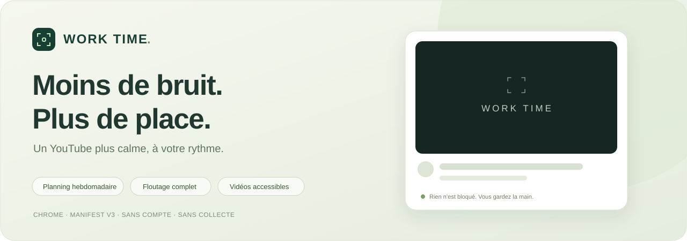
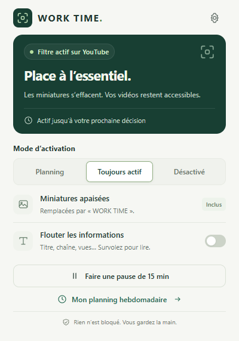
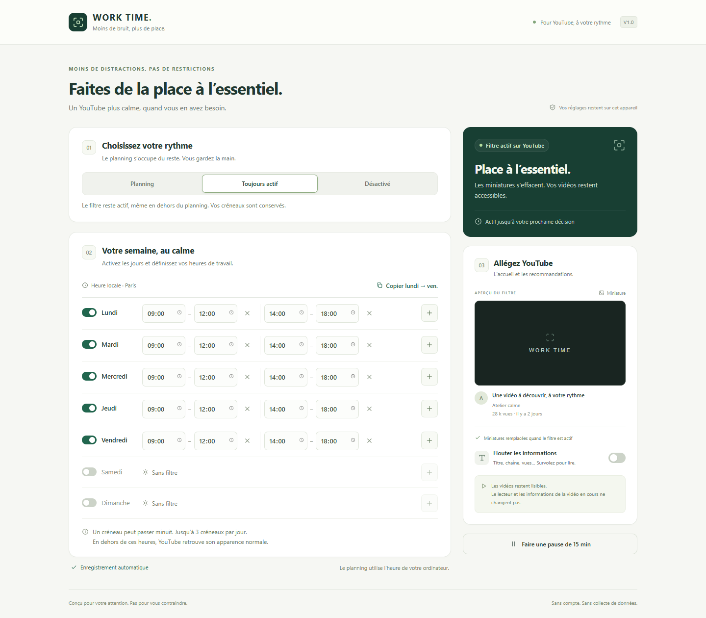
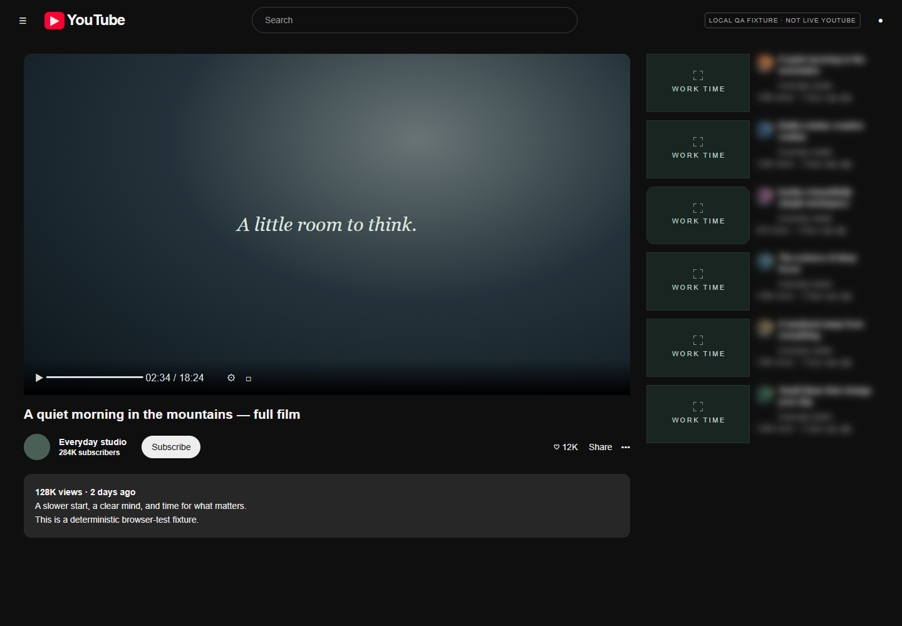
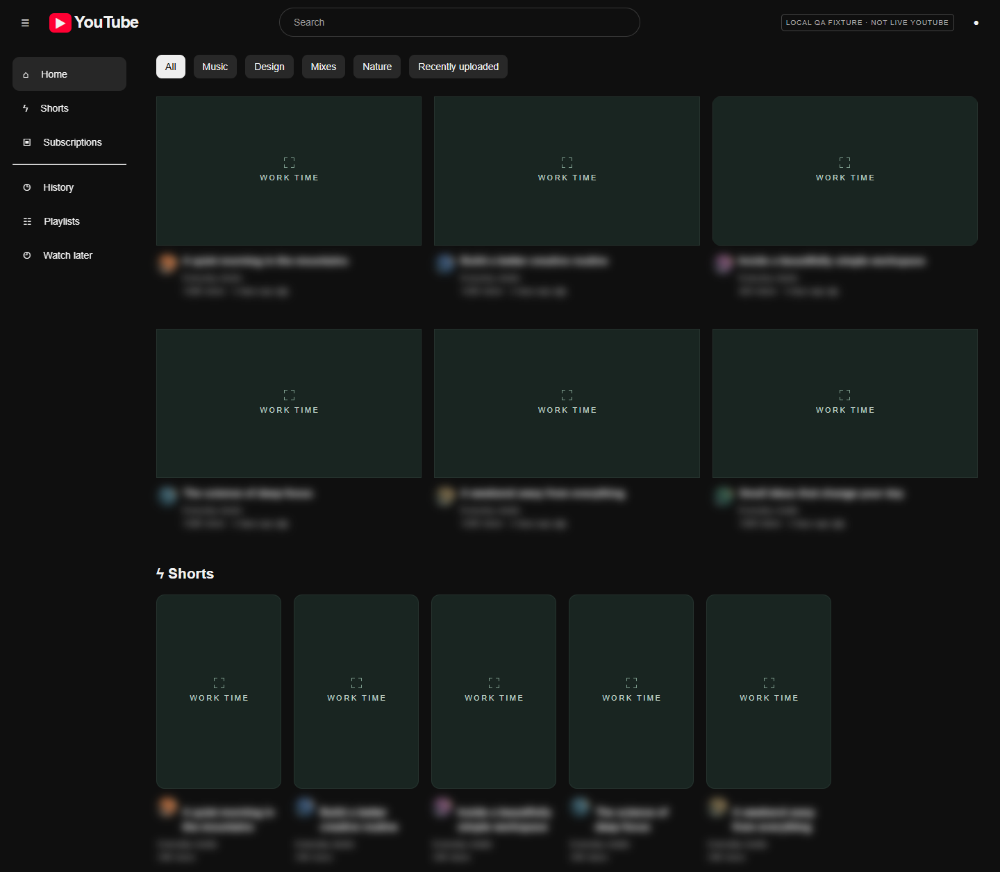

<p align="center">
  
</p>

<p align="center">
  <strong>Réduisez les distractions, pas vos possibilités.</strong><br>
  Une extension Chrome pour un YouTube plus calme, pensée pour aider à garder son attention.
</p>

<p align="center">
  <a href="https://github.com/zerr0o/YoutubeDistractionHider/releases/latest"><strong>Télécharger la V1</strong></a> ·
  <a href="#installation">Installation</a> ·
  <a href="#aperçu">Aperçu</a> ·
  <a href="docs/DEVELOPMENT.md">Développement</a> ·
  <a href="https://github.com/zerr0o/YoutubeDistractionHider/issues">Signaler un problème</a>
</p>

<p align="center">
  
  
  
  <a href="https://github.com/zerr0o/YoutubeDistractionHider/actions/workflows/ci.yml"></a>
</p>

---

## L’essentiel reste accessible

Une vidéo peut être utile pour travailler. Ce sont parfois les images, les titres et les recommandations autour qui captent toute l’attention.

**WORK TIME atténue ces sollicitations sans bloquer YouTube.** Vous pouvez toujours chercher une vidéo, ouvrir un lien et lancer la lecture.

| Moins de distractions | Toujours la main |
| --- | --- |
| **Miniatures WORK TIME** : des cartes sobres remplacent les images des vidéos. | Les liens et les vidéos restent accessibles. |
| **Floutage complet, au choix** : titre, avatar et nom de chaîne, vues, date et badges. | Le survol ou le focus clavier permet de relire les informations. |
| **Planning hebdomadaire** : jours indépendants, jusqu’à 3 créneaux par jour. | Activation permanente ou désactivation en un clic. |
| **Recommandations apaisées** : accueil, recherche, cartes Shorts et colonne de droite. | Le lecteur et les informations de la vidéo en cours restent intacts. |
| **Pause de 15 minutes** : retrouvez temporairement l’affichage normal. | Reprenez à tout moment, sans perdre votre planning. |

## Aperçu

<table>
  <tr>
    <td align="center" width="35%"><strong>Un contrôle rapide</strong></td>
    <td align="center" width="65%"><strong>Une semaine à votre rythme</strong></td>
  </tr>
  <tr>
    <td align="center" valign="top"></td>
    <td align="center" valign="top"><a href="docs/images/planning.png"></a></td>
  </tr>
</table>

### La vidéo reste au premier plan



<details>
<summary><strong>Voir aussi l’accueil et les Shorts</strong></summary>
<br>

</details>

<sub>Les vues de l’extension sont de vraies captures. Les aperçus YouTube ci-dessus utilisent des pages locales de test, signalées « LOCAL QA FIXTURE · NOT LIVE YOUTUBE ». Ils ne représentent pas un compte réel. [Méthode de validation](docs/VALIDATION.md).</sub>

## Installation

**Pas de compilation. Pas de compte à créer.** Chrome 120 ou plus suffit.

1. [Téléchargez la dernière version](https://github.com/zerr0o/YoutubeDistractionHider/releases/latest), puis décompressez **`work-time-v1.0.0.zip`** dans un dossier permanent.
2. Ouvrez **`chrome://extensions`**.
3. Activez le **Mode développeur**, en haut à droite.
4. Cliquez sur **Charger l’extension non empaquetée** et choisissez le dossier qui contient `manifest.json`.
5. Épinglez **WORK TIME**, puis rechargez les onglets YouTube déjà ouverts.

> L’extension se charge localement. Elle n’est pas publiée sur le Chrome Web Store. Ne supprimez pas son dossier après l’installation.

Vous préférez les sources ? Clonez ou téléchargez ce dépôt et chargez directement son dossier. `npm install` n’est pas nécessaire pour utiliser l’extension.

### Pour commencer

- Choisissez **Toujours actif** pour essayer immédiatement le filtre.
- Activez **Flouter les informations** si vous souhaitez aussi atténuer tout le bloc associé à la miniature.
- Ouvrez **Mon planning hebdomadaire**, puis choisissez **Planning** pour suivre vos créneaux.

| Mode | Fonctionnement |
| --- | --- |
| **Planning** | Le filtre s’active uniquement pendant vos créneaux. |
| **Toujours actif** | Le filtre reste actif, même en dehors du planning. |
| **Désactivé** | L’apparence normale revient ; vos réglages sont conservés. |

Par défaut, le planning couvre le **lundi au vendredi, 09:00–12:00 et 14:00–18:00**. Les changements valides sont enregistrés automatiquement.

<details>
<summary><strong>Créneaux, pauses et mises à jour</strong></summary>

- Chaque jour peut être activé séparément, avec jusqu’à **3 créneaux**. `+` ajoute un créneau ; `×` le supprime lorsqu’il en reste plusieurs.
- **Copier lundi → ven.** copie les heures sans changer les jours activés.
- Un créneau **22:00–02:00** commence le jour choisi et finit le lendemain, même si celui-ci est désactivé. Le début est inclus, la fin exclue.
- Deux heures identiques ou un champ vide ne sont pas enregistrés. Un message vous invite à corriger le créneau.
- Le planning suit le **fuseau horaire de votre ordinateur**, y compris les changements d’heure.
- Une pause dure **15 minutes** et reste mémorisée si la fenêtre est fermée. **Reprendre maintenant** l’annule. Changer de mode l’annule aussi.
- Après la pause, le mode choisi reprend. En mode Planning, le filtre ne se réactive que si un créneau est encore en cours.
- Pour mettre à jour les fichiers de l’extension, cliquez sur **Actualiser** dans `chrome://extensions`, puis rechargez YouTube.

</details>

## Votre attention vous appartient. Vos données aussi.

**Sans compte. Sans serveur. Sans télémétrie.**

Les préférences restent sur cet appareil dans `chrome.storage.local`. L’extension ne collecte ni historique, ni recherches, ni vidéos regardées. Elle n’ajoute aucune requête réseau, police externe ou code distant.

| Permission | Pourquoi elle est nécessaire |
| --- | --- |
| `storage` | Conserver le planning, les options et la fin d’une pause. |
| `alarms` | Actualiser le planning et le badge de l’icône. |
| Scripts sur `youtube.com` et `www.youtube.com` en HTTPS | Modifier l’affichage des miniatures et des informations. |

Pas de permission `tabs`, ni d’accès à tous les sites. [Lire la politique de confidentialité](PRIVACY.md).

## Une V1 volontairement ciblée

- **YouTube desktop uniquement** : pas YouTube Music, le site mobile ou les lecteurs intégrés ailleurs.
- **Un filtre visuel, pas un bloqueur publicitaire** : les images sponsorisées, commentaires et invitations de YouTube peuvent rester visibles. Les téléchargements effectués par YouTube ne sont pas bloqués.
- YouTube fait évoluer ses interfaces. De nouveaux formats ou tests A/B peuvent nécessiter des ajustements.
- Un bref affichage initial des images reste possible pendant la lecture des préférences. Les onglets suspendus et la veille peuvent retarder les minuteries ; l’état est recalculé au retour.

WORK TIME vous aide à alléger YouTube, sans vous imposer de restrictions.

## Développer et contribuer

JavaScript et CSS natifs, **Manifest V3**, sans étape de build ni dépendance à l’exécution.

```bash
npm ci
npm test
npx playwright install chromium
npm run test:browser
npm run package
```

La V1 a passé **21 tests unitaires et 17 vérifications navigateur**. Les tests utilisent un profil temporaire et des pages de test locales, pas votre session Chrome personnelle.

→ [Guide de développement](docs/DEVELOPMENT.md) · [Validation et limites](docs/VALIDATION.md)

Un changement de YouTube vous échappe ? [Ouvrez une issue](https://github.com/zerr0o/YoutubeDistractionHider/issues) avec la page concernée, la version de Chrome et les étapes de reproduction. Pensez à masquer toute information personnelle dans vos captures.

---

<p align="center"><strong>Conçu pour votre attention. Pas pour vous contraindre.</strong></p>
